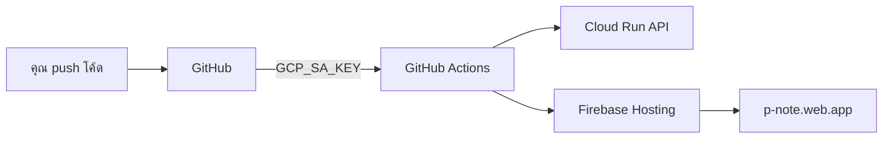

# เชื่อม Google API — ทำงานอัตโนมัติ

คู่มือนี้สำหรับให้ **GitHub Actions deploy ขึ้น Google Cloud อัตโนมัติ** ทุกครั้งที่ push โค้ด

> **สำคัญ:** Cursor Agent **ไม่สามารถ** login เข้า Google Account ของคุณโดยตรงได้  
> ต้องตั้งค่า credentials **ครั้งเดียว** (ประมาณ 5 นาที) หลังจากนั้นระบบทำงานอัตโนมัติเอง

---

## ภาพรวม



---

## ขั้นที่ 1: สร้าง Service Account (ทำครั้งเดียว)

### วิธี A — ใช้ Script (แนะนำ)

บนเครื่องที่ติดตั้ง [Google Cloud SDK](https://cloud.google.com/sdk) แล้ว:

```bash
gcloud auth login
cd P-Note
chmod +x scripts/setup-gcp-service-account.sh
./scripts/setup-gcp-service-account.sh
```

จะได้ไฟล์ `pnote-gcp-sa-key.json`

### วิธี B — ทำมือใน Console

1. เปิด https://console.cloud.google.com/iam-admin/serviceaccounts?project=mypoer
2. **Create Service Account** → ชื่อ `pnote-github-deploy`
3. ให้ Roles:
   - Cloud Run Admin
   - Artifact Registry Writer
   - Service Account User
4. **Keys** → Add Key → JSON → ดาวน์โหลด

---

## ขั้นที่ 2: เพิ่ม GitHub Secrets

เปิด https://github.com/yohaken/P-Note/settings/secrets/actions

กด **New repository secret** สร้าง 2 ตัว:

| Secret Name | ค่า | วิธีได้ |
|-------------|-----|--------|
| `GCP_SA_KEY` | เนื้อหาไฟล์ JSON ทั้งไฟล์ | จากขั้นที่ 1 |
| `FIREBASE_TOKEN` | CI token | `firebase login:ci` |

### สร้าง FIREBASE_TOKEN

```bash
npm install -g firebase-tools
firebase login:ci
# คัดลอก token ที่ได้ → ใส่ใน GitHub Secret
```

### ใส่ผ่าน CLI (ถ้ามี gh)

```bash
gh secret set GCP_SA_KEY < pnote-gcp-sa-key.json --repo yohaken/P-Note
gh secret set FIREBASE_TOKEN --repo yohaken/P-Note
# วาง token เมื่อถาม
```

---

## ขั้นที่ 3: เปิด APIs ที่จำเป็น

ใน https://console.cloud.google.com/apis/library?project=mypoer เปิด:

- [x] Google Drive API (มีแล้ว)
- [ ] Cloud Run API
- [ ] Artifact Registry API
- [ ] Cloud Build API
- [ ] Firebase Hosting API

---

## ขั้นที่ 4: เปิด Firebase Hosting (ครั้งแรก)

```bash
firebase login
firebase use mypoer
firebase hosting:sites:create p-note
firebase deploy --only hosting
```

ได้ลิงก์คงที่: **https://p-note.web.app**

---

## ขั้นที่ 5: ทดสอบ Deploy อัตโนมัติ

หลังเพิ่ม secrets แล้ว:

1. Merge PR ที่มี workflow `deploy-gcp.yml`
2. Push ขึ้น `main` หรือไปที่ **Actions** → **Deploy to Google Cloud** → **Run workflow**
3. รอ 3–5 นาที
4. ตรวจสอบ:
   - API: `curl https://p-note-api-XXXX.asia-southeast1.run.app/api/health`
   - App: https://p-note.web.app

---

## หลังตั้งค่าแล้ว — Cursor Agent ทำอะไรได้อัตโนมัติ

| งาน | อัตโนมัติ? |
|-----|-----------|
| Push โค้ด → deploy Cloud Run | ✅ |
| Push โค้ด → deploy Firebase | ✅ (ถ้ามี FIREBASE_TOKEN) |
| แก้โค้ด backend/frontend | ✅ ผ่าน PR + merge |
| Login Google Console แทนคุณ | ❌ ต้องมี secrets |
| สร้าง OAuth Client ใหม่ | ❌ ทำมือใน Console |

---

## ความปลอดภัย

- **อย่า** commit ไฟล์ `*.json` key ขึ้น GitHub
- ลบ `pnote-gcp-sa-key.json` หลังเพิ่ม secret แล้ว
- ตั้ง GCP Budget Alert $1/เดือน
- Service Account มีสิทธิ์เฉพาะ deploy (ไม่ใช่ Owner)

---

## แก้ปัญหา

| ปัญหา | วิธีแก้ |
|-------|--------|
| Actions ล้มเหลว `GCP_SA_KEY` | ตรวจ secret ว่าใส่ JSON ครบทั้งไฟล์ |
| Firebase deploy skip | เพิ่ม `FIREBASE_TOKEN` secret |
| Cloud Run 403 | เปิด Cloud Run API + ตรวจ IAM roles |
| `p-note.web.app` 404 | รัน `firebase deploy` ครั้งแรก |

---

## ขั้นถัดไป

เมื่อ secrets พร้อมแล้ว บอก Cursor Agent ว่า **"secrets พร้อมแล้ว"** — จะ trigger deploy และตรวจสอบลิงก์ให้
